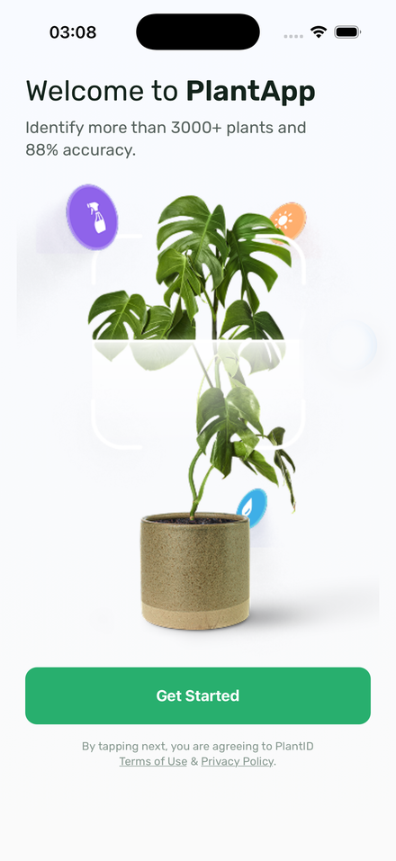
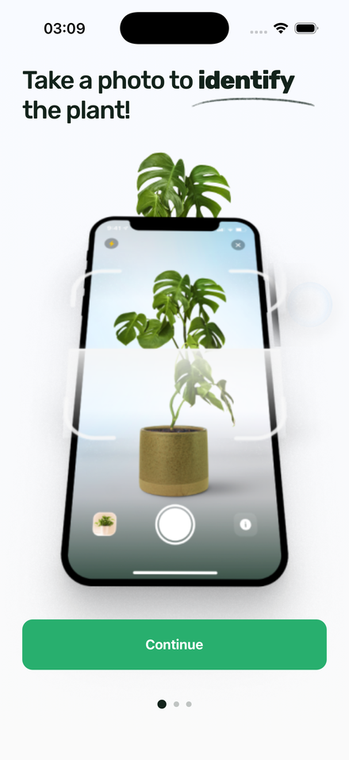
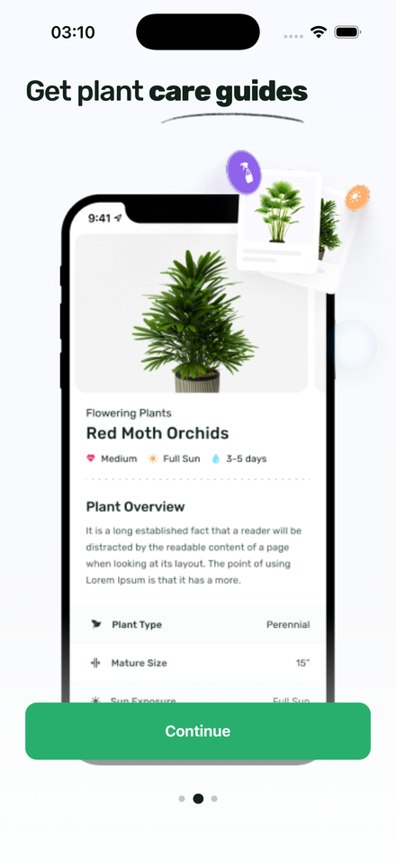
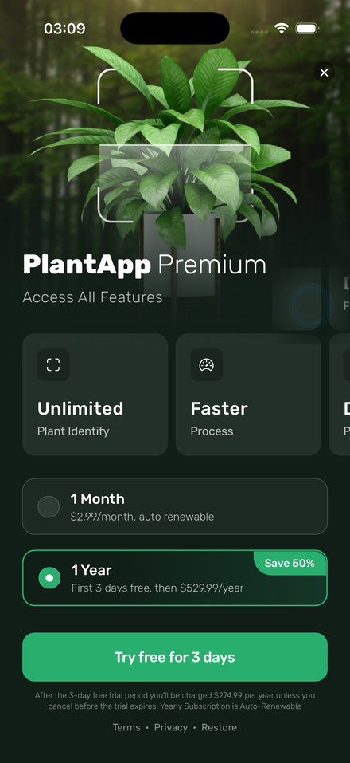
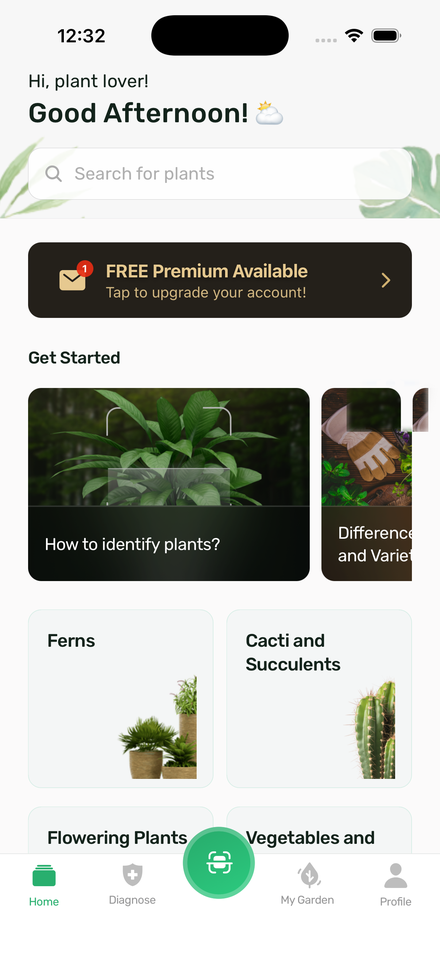

# PlantApp

A small plant-catalog app built with React Native: an onboarding flow (3 screens +
paywall) and a home tab with a plant category grid, built to a Figma design.

<p align="center">
  
  
  
  
  
</p>

## Run

```
npm install
npm start
```

Press `i` for the iOS simulator, `a` for Android, or scan the QR with Expo Go.
`npm test` runs the unit tests, `npm run typecheck` checks types.

## Why these choices

**Expo, managed workflow.** Nothing here needs a custom native module, so there's no
reason to eject. Setup and builds stay simple and it runs the same on any machine.

**Redux Toolkit + RTK Query.** The only real global state is whether onboarding is done,
so the slice is tiny. The two network calls go through RTK Query - caching and
loading/error state come for free and it stays inside Redux.

**AsyncStorage, not redux-persist.** It's one boolean. redux-persist would be a lot of
wiring for that.

**React Navigation.** Native stack for onboarding (forward only), bottom tabs for the
app. The switch between them is conditional rendering in `RootNavigator` based on the
persisted flag.

## Structure

```
src/
  components/     shared UI, icon components
  constants/      theme.ts (colors, type, spacing), layout.ts (responsive scale)
  features/
    onboarding/   get started + 2 steps
    paywall/      screen + feature/plan cards
    home/         screen + banner/search/category/question cards
  navigation/     root, onboarding stack, tab navigator + custom tab bar
  store/          store, typed hooks, onboarding slice, plant api
  types/          normalised api shapes
```

A component stays in its feature folder until something else needs it, then it moves to
`src/components`.

## Notes

- The two endpoints wrap their payload differently (`{ data: [...] }` vs a bare array).
  `transformResponse` unwraps and sorts both, so screens only see a plain sorted list.
- Onboarding ends when the paywall close (or the CTA) is tapped - that writes the flag
  and the navigator swaps to the tabs. Done users don't see it again.
- Figma frames are 375x812, so `layout.ts` scales sizes and fonts off the real screen.
  Colors, spacing and type come from `theme.ts` - no bare hex or magic numbers in components.
- The tab bar is custom (raised scan button, two icon sets). Diagnose, My Garden and the
  scan button are SVGs from the design; Home and Profile are the closest Ionicons.
- Short animated loading screen after the native splash.

## Tests

`jest-expo`, covering the onboarding reducer, the two `transformResponse` mappers, the
responsive scale helper and a `CategoryCard` render.

## Known gaps

- Home and Profile tab icons are the closest Ionicons, not the exact design glyphs
  (Diagnose, My Garden and the scan button are exported straight from the design).
